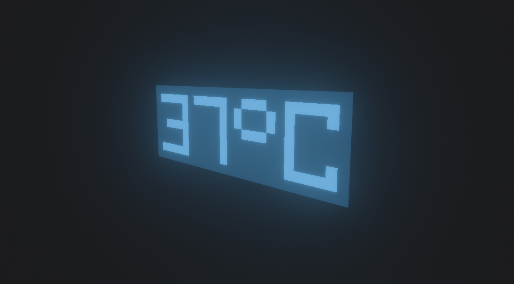

# A collection of shaders for Bevy 💠

It includes only 2 shaders now and doesn't provide any docs. Sorry, but this is temporary because it's just created />~<\


# Installation

This crate is published on [crates.io](https://crates.io/crates/bevy-shaders), so you can just type `cargo add bevy_shaders`

# Examples

**Step 1**: Enable ShadersPlugin plugin.

```rust
use bevy::prelude::*;
use bevy_shaders::prelude::*;

fn main() {
    App::new()
        .add_plugins((DefaultPlugins, ShadersPlugin))
        .run();
}
```

**Step 2**: Add a material you want. Availiable materials:

## Text Shader

Only GPU-side rendred text, you don't have to render founts to texture and pass it to the shader. For light effect like here it uses emission, so don't forget to enable [bloom shader](https://bevy-cheatbook.github.io/graphics/bloom.html).



Run this example using `cargo run --example text` and see the source code at [`/examples/text`](https://github.com/SKY-ALIN/bevy-shaders/blob/main/examples/text.rs).

## Blinking Led Shader

Randomly blinking led material. With it you don't have to make an animation for this effect.


Run this example using `cargo run --example blinking_led` and see the source code at [`/examples/blinking_led`](https://github.com/SKY-ALIN/bevy-shaders/blob/main/examples/blinking_led.rs).

---

Under dual [MIT](https://github.com/SKY-ALIN/bevy-shaders/blob/main/LICENSE-MIT) and [Apache-2.0](https://github.com/SKY-ALIN/bevy-shaders/blob/main/LICENSE-APACHE) licenses, you can choose which one is more comfortable for you.
